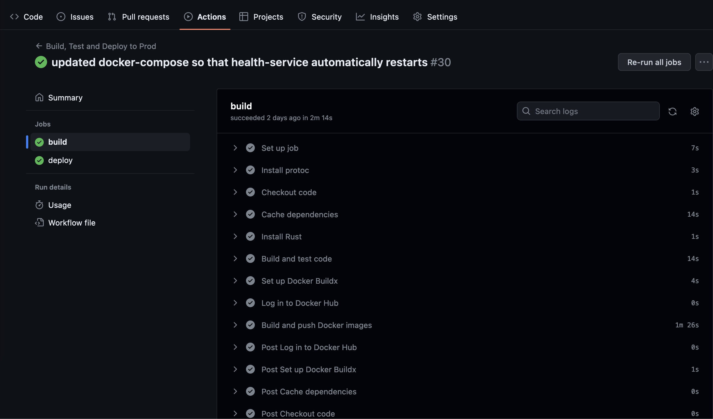

# Stage 2

__Overview__

You now have a functioning app however it only runs on your local machine. In this stage we will go through the process of deploying your app so you can show it off to others! We will also setup continuous integration to prevent code changes from breaking your app.

## CI/CD Tools

There are the tools we'll be using to setup CI/CD.

### Github Actions

[GitHib Actions](https://docs.github.com/en/actions) allow us to execute arbitrary workflows by simply adding a `YAML` file to our repository.

Here is a great overview video: https://youtu.be/eB0nUzAI7M8

### Docker

[Docker](https://www.docker.com/) is a platform for building, running, and shipping applications in containers. Containerization is a technology that allows developers to package an application with all of its dependencies into a standardized unit, called a container, which can be easily deployed across different environments, including local machines, data centers, and cloud providers. Containers are lightweight, portable, and secure, enabling teams to build and deploy applications faster and more reliably.

Here is a great overview video: https://youtu.be/Gjnup-PuquQ

### DigitalOcean

[DigitalOcean](https://www.digitalocean.com/) is a cloud computing platform that provides virtual servers (called "Droplets") and other infrastructure services to developers and businesses. It offers a simple and intuitive user interface, along with flexible pricing plans that allow users to pay only for what they use. DigitalOcean supports a wide range of operating systems and application stacks, making it a popular choice for hosting web applications, databases, and other workloads.

Here are 2 great overview videos: https://youtu.be/goiq9PZLlEU & https://youtu.be/HODYl1KffDE

## Steps

### Step 1

__Configuring Docker__

Follow these steps to setup Docker:

1. Create an account on [Docker Hub](https://hub.docker.com/). This is where we will push our images.
2. Install Docker Desktop: https://docs.docker.com/get-docker/.
3. Launch Docker Desktop
4. Copy over `.dockerignore`, `Dockerfile-auth`, `Dockerfile-health`, and `docker-compose.yaml` to your repository.
5. Inside `Dockerfile-health` and `docker-compose.yaml`, replace "auth-microservice" with the name of your root directory.
6. Inside `docker-compose.yaml` replace "letsgetrusty" with your Docker Hub username.

---

`.dockerignore`

We use this file to tell Docker which files it should ignore.

`Dockerfile-auth` & `Dockerfile-health`

These are the Docker files for our two services. 

---

```docker
FROM rust:1.68.2-alpine3.17 AS chef
```

We start with the official Rust image which has all the dependencies we need to build a Rust project.

```docker
RUN apk add --no-cache musl-dev & cargo install cargo-chef
```

Then we install `musl-dev` and [cargo-chef](https://crates.io/crates/cargo-chef). [musl](https://musl.libc.org/) is an implementation of the C standard library built on top of the Linux system call API. [We need it for `cargo-chef` to work](https://github.com/LukeMathWalker/cargo-chef/blob/5f791e86e87db5bf3add5be5a91e0d06b03c42b4/docker/Dockerfile#L6). `cargo-chef` allows us to cache dependencies in our Rust project and speed up your Docker builds.

```docker
FROM chef AS planner
COPY . .
RUN cargo chef prepare --recipe-path recipe.json

FROM chef AS builder
COPY --from=planner /auth-microservice/recipe.json recipe.json
# Build dependencies - this is the caching Docker layer!
RUN cargo chef cook --release --recipe-path recipe.json
# Build application
RUN apk add --no-cache protoc
COPY . .
RUN cargo build --release --bin auth
```

Then we run `cargo-chef`, install `protoc`, and build the service  in release mode.

```docker
FROM debian:buster-slim AS runtime
WORKDIR /auth-microservice
COPY --from=builder /auth-microservice/target/release/auth /usr/local/bin
ENTRYPOINT ["/usr/local/bin/auth"]
```

Finally we create a new bare-bones image, copy over the binary we created in the previous step, and execute it! One of the advantages of Rust is that our apps can be compiled down to a single binary.

`docker-compose.yaml`

[Docker Compose](https://docs.docker.com/compose/) is a tool for defining and running multi-container Docker applications. With Compose, you use a YAML file to configure your application’s services. Then, with a single command, you create and start all the services from your configuration.

```yaml
version: "3.9"
services:
  health-check:
    image: letsgetrusty/health-check # specify name of image on Docker Hub
    build: # specify which Docker file to use
      context: .
      dockerfile: Dockerfile-health
    restart: "always" # automatically restart container when server crashes
    depends_on: # ensure that `health-check` starts after `auth` is running
      auth:
        condition: service_started
  auth:
    image: letsgetrusty/auth # specify name of image on Docker Hub
    build: # specify which Docker file to use
      context: .
      dockerfile: Dockerfile-auth
    restart: "always" # automatically restart container when server crashes
    ports:
      - "50051:50051" # expose port 50051 so that applications outside the container can connect to it 
```

In our case we need to define an auth service and a health check service. 

---

After completing the steps above you should be able to start your application via Docker Compose.

Run `docker-compose up` in the root of your project directory.

You should see console log output from both services in your terminal.

Press `CTRL-C` in your terminal window to stop the services.

Congratulations, you've Dockerized your app and are now ready to deploy it! 

### Step 2

__Setting up continuous integration__

Before we talk about continuous deployment let's setup continuous integration. 

Specifically, we will add a GitHub Actions workflow that builds and tests our code before it is merged into master.

Copy over the `.github/workflow/prod.yml` file to your repository. 

---

```yaml
on:
  push:
    branches:
      - master
   pull_request:
    branches:
      - master
```

First we define when we want our workflow to run. In this case we want to run the workflow whenever code gets pushed to master or when a pull request for the master branch is created.

```yaml
jobs:
  build:
    runs-on: ubuntu-latest

    steps:
    - name: Install protoc
      uses: arduino/setup-protoc@v1

    - name: Checkout code
      uses: actions/checkout@v2
```

Then we define each step in our `build` job. First we install protoc and checkout the source code.

```yaml
    - name: Cache dependencies
      uses: actions/cache@v3
      with:
        path: |
          ~/.cargo
          target/
        key: ${{ runner.os }}-cargo-${{ hashFiles('**/Cargo.lock') }}
        restore-keys: ${{ runner.os }}-cargo-
```

Then we use the cache action to cache the `/.cargo` and `target/` directories. 

```yaml
    - name: Install Rust
      uses: actions-rs/toolchain@v1
      with:
        profile: minimal
        toolchain: stable

    - name: Build and test code
      run: |
        cargo build --verbose
        cargo test --verbose
```

Finally we build and test the app.

---



After adding `.github/workflow/prod.yml` to your repository and pushing the changes up to master, you should see your Github Action execute.

### Step 3 (Optional)

__Setting up continuous deployment__

TODO